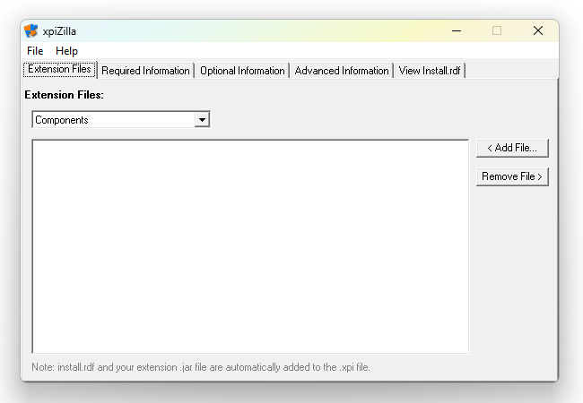
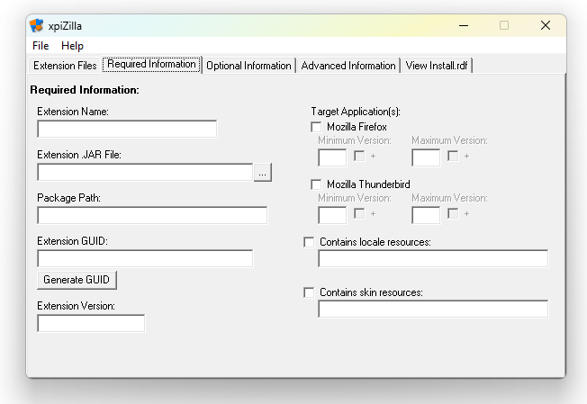
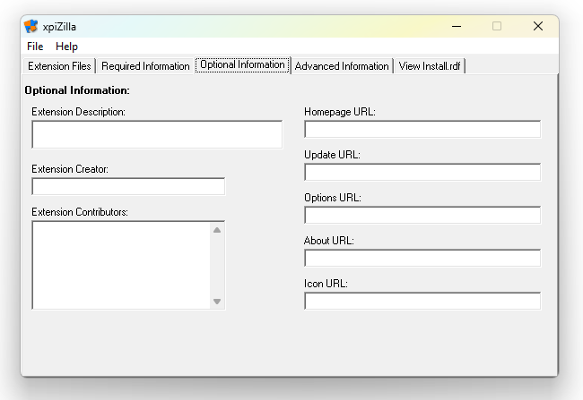
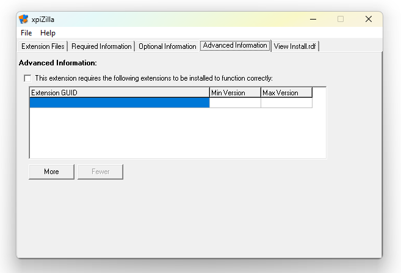
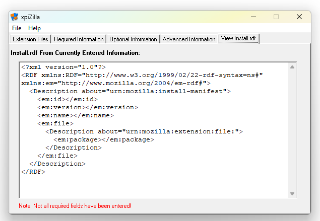
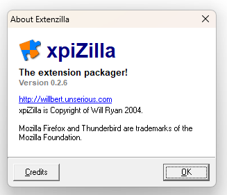

# xpiZilla
Old Delphi Project I created in 2004 for create Firefox extension packages and metadata. It was originally named Extenzilla, but I renamed it to XpiZilla because there was already a Firefox site called Extenzilla at the time where people discussed Firefox extensions

## Screenshots

*Extension Files tab*

*Required Information tab*

*Optional Information tab*

*Advanced Information tab*

*View Install.rdf tab*

*About popup*